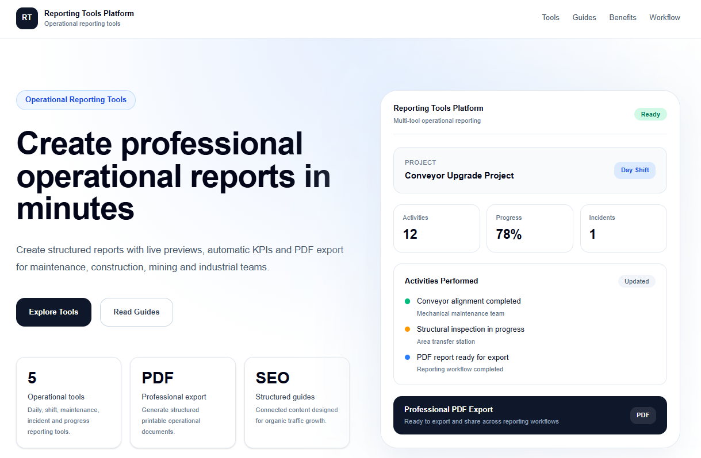

# Reporting Tools Platform

A browser-based platform for creating professional operational reports, shift handovers, maintenance documents, incident reports and project progress reports.

**Live website:**  
https://reporting-tools-platform.vercel.app/

**Browse all tools:**  
https://reporting-tools-platform.vercel.app/tools

**Explore reporting guides:**  
https://reporting-tools-platform.vercel.app/guides



## Overview

Reporting Tools Platform helps operations, maintenance, construction and field teams create structured reports without manually formatting documents.

Each tool provides:

- Structured input forms
- Live report preview
- Automatic calculations and KPIs
- Consistent report layouts
- Browser-based PDF export
- No software installation required

The project is designed as a focused family of reporting utilities rather than a large ERP or enterprise management system.

## Why I Built It

Many operational teams still prepare reports using Word documents, spreadsheets, emails or copied templates.

This often creates problems such as:

- Inconsistent report formats
- Missing information
- Repetitive manual work
- Difficult handovers between shifts
- Poor visibility of pending tasks
- Documents that are difficult to archive or share

Reporting Tools Platform provides a simpler workflow:

1. Complete a structured form
2. Review the live preview
3. Export the finished report as PDF

## Available Tools

### Daily Report Generator

Create structured daily operational reports with:

- Project and shift details
- Daily summary
- Activities performed
- Working hours
- Automatic KPIs
- Safety and incident information
- Observations
- Pending tasks
- PDF export

**Open tool:**  
https://reporting-tools-platform.vercel.app/tools/daily-report-generator

---

### Shift Handover Generator

Create professional shift handover reports with:

- Outgoing and incoming shift details
- Work completed
- Equipment status
- Pending tasks
- Incidents and risks
- Recommendations
- PDF export

**Open tool:**  
https://reporting-tools-platform.vercel.app/tools/shift-handover-generator

---

### Maintenance Report Generator

Create equipment maintenance and service reports with:

- Equipment details
- Maintenance type
- Work summary
- Findings
- Maintenance tasks
- Parts and materials used
- Recommendations
- PDF export

**Open tool:**  
https://reporting-tools-platform.vercel.app/tools/maintenance-report-generator

---

### Incident Report Generator

Create workplace incident and corrective-action reports with:

- Incident details
- Severity and status
- Immediate actions
- Root cause information
- Corrective actions
- Responsible persons
- Recommendations
- PDF export

**Open tool:**  
https://reporting-tools-platform.vercel.app/tools/incident-report-generator

---

### Progress Report Generator

Create structured project progress reports with:

- Project details
- Reporting period
- Planned progress
- Actual progress
- Activity tracking
- Issues and delays
- Next steps
- PDF export

**Open tool:**  
https://reporting-tools-platform.vercel.app/tools/progress-report-generator

## Reporting Guides

The platform contains 30 practical guides organized into five reporting categories.

### Daily Reports

- How to Write a Daily Report
- Daily Work Report Sample
- How to Write a Daily Report to Your Boss
- How to Write a Daily Report for Construction
- Daily Report Examples
- Daily Report Format
- Daily Activity Report
- Daily Status Report to Manager
- End of Day Report
- Daily Work Report Template
- Daily Site Report
- Employee Daily Report

### Maintenance Reports

- How to Write a Maintenance Report
- Maintenance Report Example
- Maintenance Reporting Guide
- Preventive Maintenance Report
- Equipment Maintenance Report
- Maintenance Checklist

### Incident Reports

- How to Write an Incident Report
- Incident Report Example
- Safety Incident Report
- Near Miss Report
- Corrective Action Report

### Progress Reports

- How to Write a Progress Report
- Weekly Progress Report
- Project Status Report
- Monthly Progress Report

### Shift Handover

- How to Write a Shift Handover Report
- Shift Handover Example
- Shift Handover Checklist

**Explore all guides:**  
https://reporting-tools-platform.vercel.app/guides

## Key Features

- Responsive design for desktop and mobile
- Structured report forms
- Real-time preview
- Reusable report sections
- Automatic KPI calculations
- Dynamic activity and task lists
- PDF-ready print layouts
- SEO-friendly guide pages
- Canonical URLs
- XML sitemap
- robots.txt
- Internal linking between guides and tools
- Category-based guide navigation

## Typical Use Cases

Reporting Tools Platform can be used by:

- Construction supervisors
- Maintenance technicians
- Operations coordinators
- Project managers
- Shift supervisors
- Safety personnel
- Contractors
- Field inspectors
- Industrial teams
- Logistics and warehouse teams

## How It Works

1. Select a reporting tool.
2. Enter project, equipment or incident information.
3. Add activities, tasks, parts or corrective actions.
4. Review the live report preview.
5. Export the final document as PDF.

All processing happens directly in the browser.

## Tech Stack

- Next.js
- React
- TypeScript
- Tailwind CSS
- App Router
- Next.js Metadata API
- Browser print-to-PDF workflow
- Vercel deployment

## Project Structure

```text
app/
  guides/
    (daily-reports)/
    (maintenance)/
    (incident)/
    (progress)/
    (handover)/
    page.tsx

  tools/
    daily-report-generator/
    shift-handover-generator/
    maintenance-report-generator/
    incident-report-generator/
    progress-report-generator/

  layout.tsx
  page.tsx
  robots.ts
  sitemap.ts

components/
  home/
  incident/
  handover/
  layout/
  maintenance/
  progress/
  report/

lib/
  incident/
  handover/
  maintenance/
  progress/
  report/
  guides.ts
  tools.ts

docs/
  reporting-tools-platform-preview.png
```
